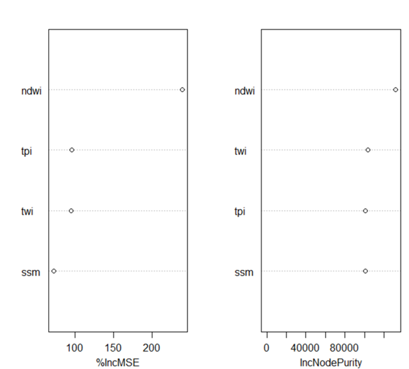
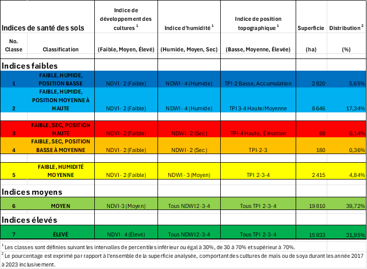
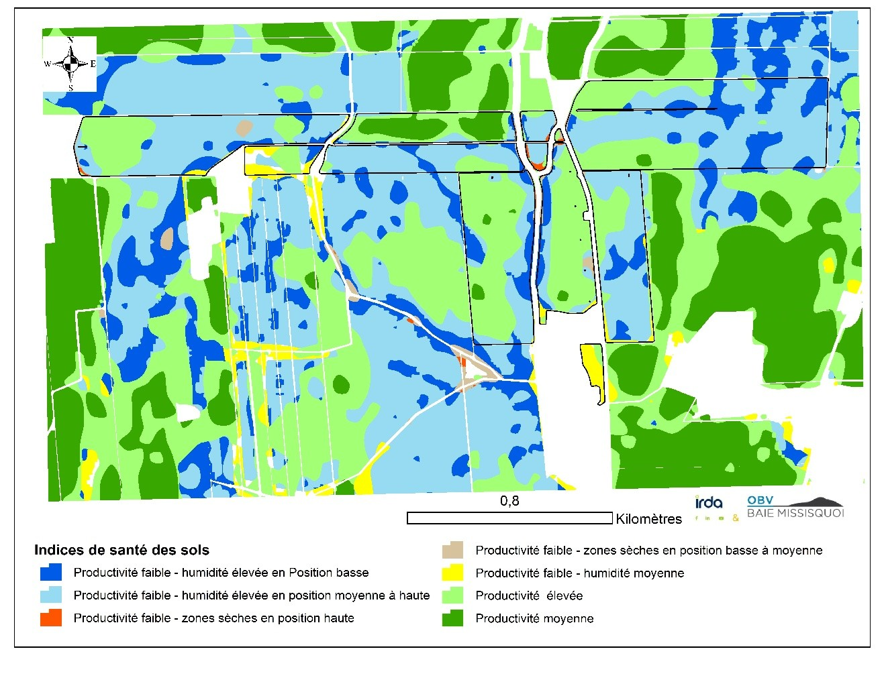

# Rapport : Classification des Indices de Santé des Sols

## La classification

La stratégie adoptée avant la classification des indices de santé, basée sur les diverses covariables citées (NDVI, NDWI, SSM, TPI et TWI), est d’effectuer une **analyse par régression multiple par forêt aléatoire** des 5 covariables restantes avec le NDVI.

Cette approche nous permet de voir l’importance des covariables et d’en choisir les plus pertinentes.

Deux métriques pour les mesures de performance ont été utilisées :

1. **%IncMSE** : indique l'augmentation de l'erreur quadratique moyenne des prédictions résultant de la permutation des covariables.
2. **IncNodePurity** : lié à la fonction de perte qui détermine les meilleures répartitions. Plus ce nombre est élevé, plus la variable est utile.

### Interprétation des métriques

- Pour le **%IncMSE** : plus le nombre est élevé, plus la variable est importante.
- Pour le **IncNodePurity** : des variables plus utiles permettent d'obtenir des augmentations plus importantes de la pureté des nœuds.

### Résultats

- **NDWI** présente la valeur la plus élevée pour les deux métriques.
- **TPI** et **TWI** ont des valeurs proches.
- **SSM** présente la valeur la plus faible.

### Conclusion

Ce constat permet de considérer **NDWI**, **TPI** et **NDVI** comme les covariables les plus pertinentes dans le développement du modèle de classification des indices de la santé des sols.

## Approche orientée objet

Un autre aspect de cette classification est qu’elle est **orientée objet**. Au lieu d’effectuer la classification sur les intensités des pixels, elle est basée sur les **percentiles** des **médianes** :

- `< 30 %`
- `30 – 70 %`
- `> 70 %`

Des règles de décisions sont ensuite établies en fonction de ces classes.

---

